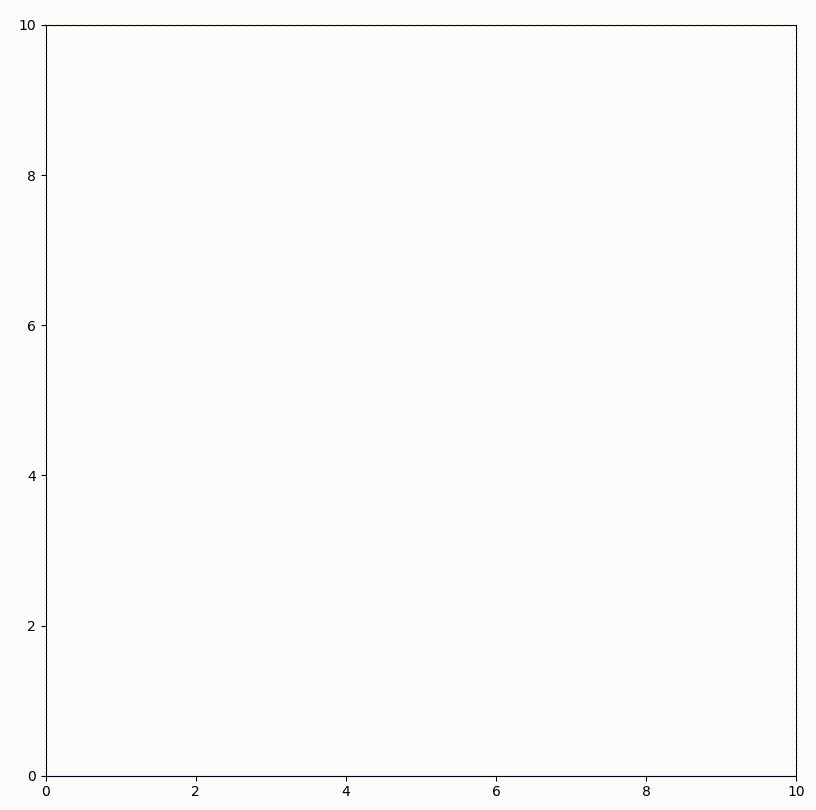
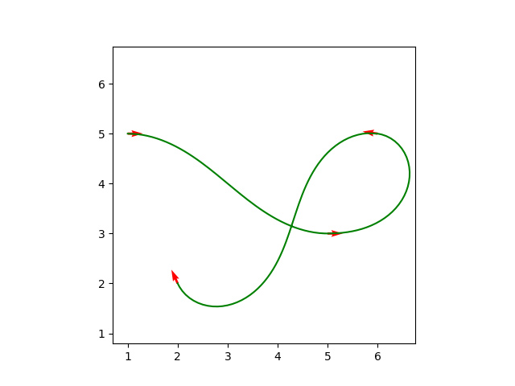
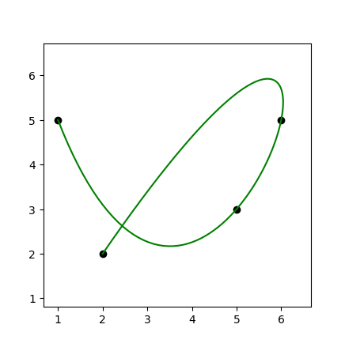

# GenerateCurveTool

A tool of generating the common curves from way points for the robot path planning, including dubins path, reeds shepp, etc.

Dubins path  |   Reeds Shepp    |   Clothoid   |           BSpline            |
:-------------------------:|:-------------------------:|:-------------------------:|:----------------------------:|
  |  |  |  |

## Prerequisite

- Python: >= 3.8
    - numpy  
    - matplotlib 
    - pyclothoids
    - scipy

## Usage 

The examples are in [GenerateCurveTool/example/](https://github.com/hanruihua/GenerateCurveTool/tree/main/example)

## Roadmap

- [x] Direct line
- [x] Dubins path
- [x] Reeds shepp
- [x] Clothoid
- [x] b-spline
- [ ] bezier 

